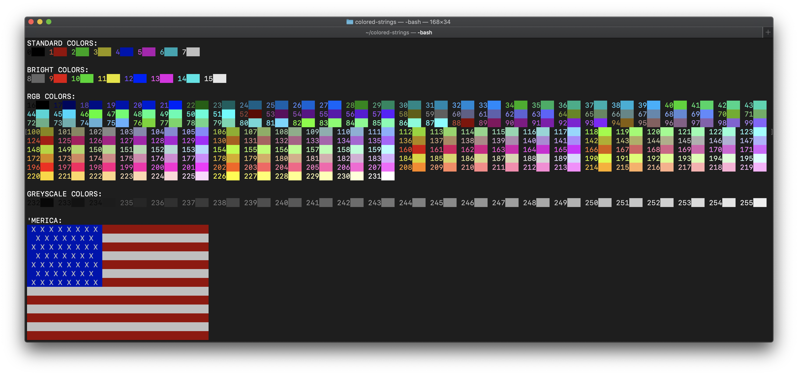

# Colored String

The `colored_string` class is an extension of `std::string` that adds 8-bit ANSI foreground and background colors when printing to the terminal (assuming your terminal supports it). To use, add `#include "colored_string.h"` and compile/link the cpp files in this project. For an example, run `demo.cpp` with the included `Makefile`. See the image below for the terminal output when `demo` was executed on macOS.

## Colors

Every supported color has a unique 8-bit ANSI code, yielding a total of 256 or 2^8 possible colors. All references to ANSI in this document should be assumed to mean 8-bit ANSI unless otherwise specified. More information about ANSI color codes can be found on [Wikipedia](https://en.wikipedia.org/wiki/ANSI_escape_code#8-bit). In code, `unsigned char` (as `color_t`) is used to represent ANSI color values. All enum classes also use `color_t` as their underlying type so that everything is compatible. These can be converted into `color_t` by using the helper function `underlying`. In addition, integer literals can be expressed as `color_t` directly by using `operator"" _c`.

Each (non-abstract) color class implements the `color` interface (abstract class). This interface exposes a public `code` function that returns a `color_t` representing the ANSI code for this color. Every `color` can also polymorphically clone itself. This operation explicitly calls `new`. Thus it's encapsulated privately, and only available to the `colored_string` friend class.

From here on out, define [*n*] := {0, ..., *n* - 1} and [*a*, *b*] := {*a*,...,*b*} for integers *n* > 0 and *a* < *b*.

### Palette

Palette based colors are those that can be constructed via the `palette` enum class, consisting of 8 standard colors. There are 2 palette based color classes.

- `standard_color`: codes in [0, 7]
- `bright_color`: codes in [8, 15]

The available `palette` enumerations are black, red, green, yellow, blue, magenta, cyan, and white.

### RGB

The ANSI color standard specifies 216 or 6^3 possible RGB colors. The `rgb_color` class has codes in [16, 231]. Each channel can take values in [6]. In order to support both ANSI and "true color" 24-bit RGB, an `rgb_color` can be constructed via 3 `channel` enum classes (possible values in C[6]) or via 3 `color_t` parameters. In the latter case, `rgb_color` will uniformly map [256] -> [6].

### Greyscale

The `greyscale_color` class has codes in [232, 255]. They are specified by the `grey` enum class (possible values in G[24]), which represents a 24-step color gradient from black (G0) to white (G23).

## Strings

Using the polymorphic behavior of the `color` interface, each `colored_string` (which publically inherits from `std::string`) is fully specified by adding 2 colors for the foreground and background. Since `std::string` has so many constructors, the design choice was made to determine colors after the `colored_string` was constructed. This allows for constructor parameters to `colored_string` to be perfectly forwarded to the underlying `std::string` constructor without obstruction.

Another notable design choice for `colored_string` is its `const` properties. The foreground and background colors are `mutable` and are thus not part of the `const`-ness of the `colored_string`. Hence, all operations that are valid on a `const std::string` are also valid on a `const colored_string`. This has additional benefit of allowing the foreground and background colors to be set, replaced, and reset on the fly without modifying the underlying `std::string`.

### Escape Sequences

The colors do not come into play until the overloaded `operator<<` is called. A null foreground or background color means that the default foreground or background is used, respectively. Otherwise, escape sequences are added such that a color with code *x* will have the sequence `\033[<g>;5;<x>m` inserted into the stream (`<x>` = *x*) before the body of the string. Substitute `<g>` with `38` for foreground colors and `48` for background colors. This operation assumes that the ANSI symbols for begin and end escape sequences are `\033` and `m` respectively, which is often the case.

After the body of the string, the sequence `\033[0m` is added to reset foreground and background back to their default states. This is the main advantage of encapsulating the color state into a `colored_string` class. Objects have a user-defined lifetime and scope unlike `std::cout` and `std::cerr`. The user is free to print strings with any foreground and background combination. The color state of the stream always returns to default. Without this encapsulation, the user must keep track of state after every stream insertion.
